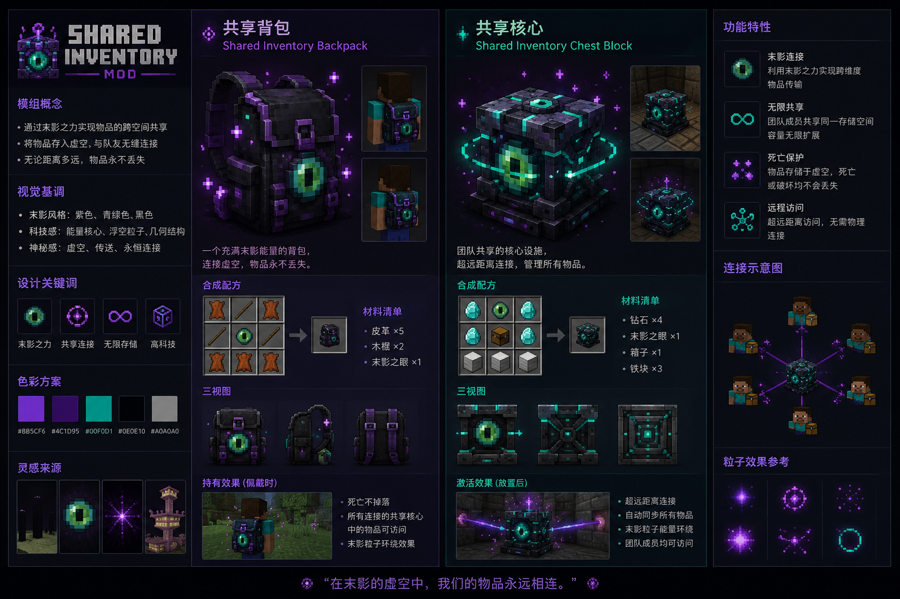

<div align="center">

# SharedInventoryMod · 共享存储



为 Minecraft 1.19.4 打造的 Fabric 模组，把**超大私人背包**、**玩家间共享背包**和**便携工作区**整合进同一界面。

一个背包，连接所有伙伴。

</div>

---

## ✨ 特性一览

- 🎒 **超大私人背包** — 60 格/页 × 24 页共 **1440 格**的随身存储，支持分页与页签标签快速跳转。
- 🔗 **共享核心** — 在世界中放置一个方块作为"仓库中枢"，所有绑定的背包共享同一份 4×4 物品栏。
- 🧰 **便携工作区** — 在背包界面内一键切换 **合成台 / 熔炉 / 酿造台 / 铁砧 / 锻造台**，随时随地进行加工。
- 💀 **死亡不掉落** — 私人背包与装备的背包在死亡重生、跨维度传送后依然保留。

---

## 🧊 核心物品

### 共享核心（Shared Core）

存放**公共物品**的方块实体。背包绑定到某个共享核心后，就能读写该核心内的 4×4 = 16 格共享空间。

**合成配方：**

```
钻石  末影之眼  钻石
钻石   箱子    钻石
铁块   铁块    铁块
```

### 共享背包（Shared Inventory Backpack）

打开整合界面（私人背包 + 共享背包 + 工作区）的钥匙。**右键穿戴到胸甲栏位**，穿戴后按下 <kbd>B</kbd> 即可打开。

**合成配方：**

```
皮革   木棍   皮革
木棍  末影之眼  木棍
皮革   皮革   皮革
```

---

## 📖 使用方法

### 1. 绑定共享核心

手持**共享背包**右键点击放置好的**共享核心**方块，背包会记录核心坐标，聊天栏提示「成功链接到共享核心!」。

### 2. 穿戴背包

手持背包**右键**即可装备到**专属背包栏**（独立于胸甲栏的隐藏栏位，不占用护甲槽）。

### 3. 打开界面

穿戴后按下 <kbd>B</kbd> 键（默认绑定，可在「选项 → 控制 → 按键设置 → 共享存储」中修改），打开整合界面：

| 区域 | 说明 |
| --- | --- |
| **私人背包**（左侧 6×10） | 你自己独享的存储，可翻页（共 24 页） |
| **共享背包**（右侧 4×4） | 所有绑定同一核心的玩家共享，实时同步 |
| **工具区**（底部） | 合成台 / 熔炉 / 酿造台 / 铁砧 / 锻造台，按需切换 |
| **盔甲 + 副手** | 与原版装备栏一致 |
| **玩家物品栏 + 快捷栏** | 与原版一致 |

### 4. 翻页与标签

- 「上 / 下」按钮：逐页浏览。
- 「前往」按钮：输入页码或页签名直接跳转；页签名支持精确/模糊匹配。

---

## ⚙️ 依赖与环境

| 项目 | 版本 |
| --- | --- |
| Minecraft | 1.19.4 |
| Fabric Loader | ≥ 0.16.10 |
| Fabric API | 0.87.2+1.19.4 |
| Java | ≥ 17 |

---

## 🔧 从源码构建

```bash
# Windows
./gradlew.bat build

# macOS / Linux
./gradlew build
```

构建产物位于 `build/libs/`，其中 `SharedInventoryMod-fabric-1.19.4-1.0.jar` 为可分发的模组文件。

将其放入 `.minecraft/mods/`，同时安装 [Fabric API](https://modrinth.com/mod/fabric-api) 即可游玩。

---

## 🗂️ 项目结构

```
src/main/java/com/petrichor/sharedInventory/
├── SharedInventoryMod.java          # 主入口（注册物品/方块/网络包）
├── SharedInventoryModClient.java    # 客户端入口（按键、渲染）
├── block/                           # 共享核心方块与方块实体
├── item/                            # 共享背包、背包 Inventory 包装
├── inventory/                       # 私人背包、工作区逻辑、交互处理
├── screen/                          # 整合界面 ScreenHandler
├── network/                         # 翻页 / 标签 / 打开背包网络包
├── mixin/                           # 玩家数据持久化、死亡保留、背包渲染
└── client/                          # 背包穿戴渲染
```

---

## 🌐 本地化

内置三种语言：

- 简体中文（zh_cn）
- 繁体中文（zh_tw）
- English（en_us）

如需新增语言，在 `src/main/resources/assets/shared_inventory_mod/lang/` 下添加对应 JSON 文件即可。

---

## 📜 许可证

本项目基于 [**GPL-3.0**（GNU General Public License v3.0）](https://www.gnu.org/licenses/gpl-3.0.html) 协议发布。

你可以自由地**使用、研究、修改和分发**本软件，但任何衍生作品必须同样以 GPL-3.0 协议发布并开源。

完整法律文本见 [LICENSE](./LICENSE)。

---

<div align="center">

作者：**Petrichor** · 适用于 Minecraft 1.19.4 (Fabric)

</div>
